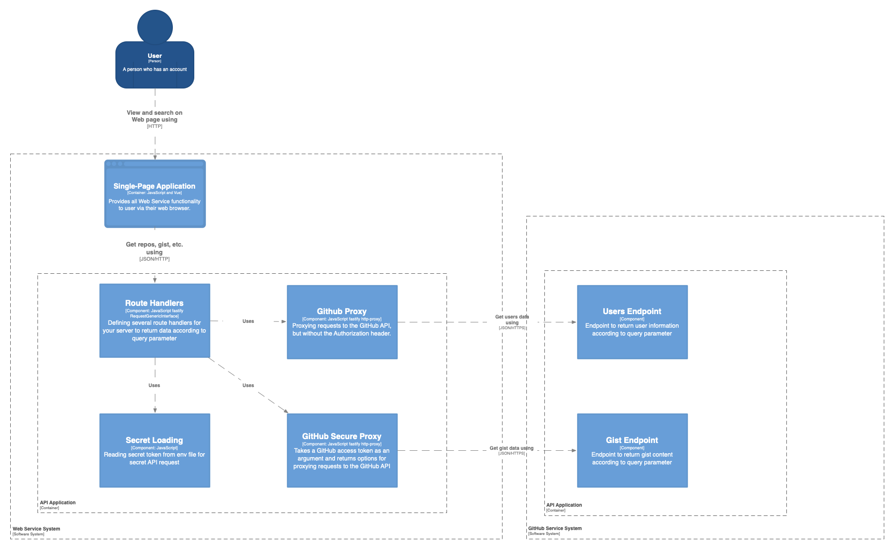

Final Project Deliverable
==============

# 1. Features of this Website

This website has 5 sub-pages: `Home`, `Stars`, `Search`, `Gist,` and `About`.

- The `Home` page just shows a simple welcome message.
- the `Stars` page will show a list of starring repositories of the user `trotyoung` from GitHub. Currently, this page can only show the first 30 starring repositories.
- The `Search` page will allow users to search the starred repository by name or language.
  - When using `Repo Name` to search, you may try `upgit`, `tart`, etc.
  - When using `Language` to search, you may try `Python`, `Go`, etc.
- The `Gist` page will show a list of files in the gist of the user `trotyoung` from GitHub.
- The `About` page will show some information about the author of this website.

> All data are fetched from GitHub via GitHub API.\
> Some of them require authentication, which will use the `ghsecure` proxy to access the GitHub API.\
> Other data are from public API, which will use the `ghproxy` proxy.

# 2. Architectural model

## 2.1. Architecture Model Diagram
Here is the diagram for the `Architectural Model` of this website.
<!--  -->

<!-- {width=10%} -->


## 2.2. Architecture Decisions

`Vue.js` was chosen as the frontend framework because of the following reasons:

- Vue's clear syntax makes it easy to learn and use.
- Vue's reactivity system makes keeping the UI in sync with the underlying data easy.
- Vue's Component-Based Architecture makes code reuse and maintenance easier.

`Fastify` was chosen as the backend framework because it is easy to use and uses JSON schema to validate routes and serialize outputs, enhancing performance and reliability.

`Fastify-http-proxy` was chosen because:
- It can help us to proxy secure requests as well as public requests.
- It easily integrates into our existing server and provides a simple way to forward requests to other services.


## 2.3. Quality Attributes
- Usability: this website is easy to use. Each page has a very straightforward function and the user can easily understand what the page is used for.

- Performance: this website's response time is related to the `GitHub API` response time.

- Scalability: the services of this website are stateless, so it can be scaled horizontally by adding more instances.

- Reliability: this website has no persistent data, all data are fetched from `GitHub API`, so it is very reliable.

- Security: This website uses the `ghsecure` proxy to access the `GitHub API`, which can protect the `GitHub API` token from being exposed to the client.

# 3. Frontend service project(client):

## 3.1. Setup
### 3.1.1. Enter the project directory and make sure you have node and yarn installed

```sh
cd client
yarn
```

### 3.1.2. Compile and Hot-Reload for Development

```sh
yarn dev
```

### 3.1.3. Type-Check, Compile, and Minify for Production

```sh
yarn build
```
### 3.1.4. Access the website

Open the browser and enter the URL: http://localhost:3000

# 4. Backend service project(server): 

## 4.1. Setup

### 4.1.1. Enter the project directory and make sure you have `node` and `yarn` installed

```sh
cd server
yarn
```

### 4.1.2. Then run the server by executing

```sh
yarn run server
```

## 4.2. Backend API
The server port was set to listen on 5000, clients can use the `/search` endpoint via URLs like the below:
1. http://localhost:5000/search?name=tart
2. http://localhost:5000/search?language=javascript

# 5. Integration with GitHub via backend service

## 5.1. Secure access:
- Access the gists by URL
> http://localhost:5000/ghsecure/gists

- access the gist of the hello world file by gist_id
> http://localhost:5000/ghsecure/gists/b5e222c31972e1e64c31764c3826c0a2

## 5.2. Public access
- starred repos of user
> http://localhost:5000/ghproxy/users/trotyoung/starred

