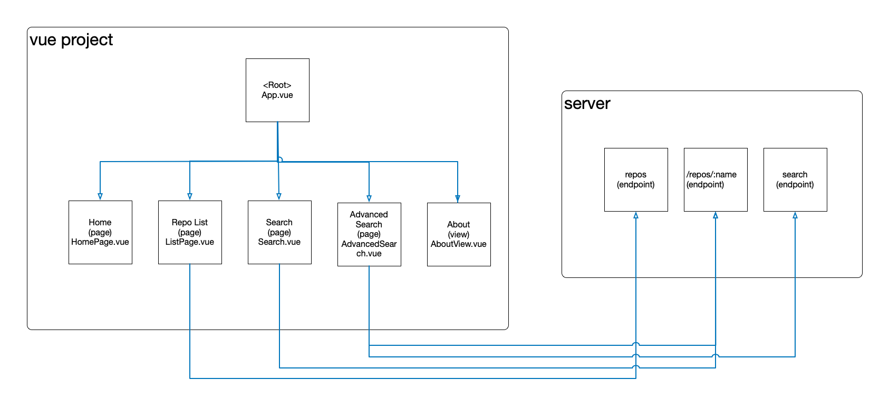

# Frontend service project: vue-project

## Project Setup

### Enter project directory and make sure you have node and yarn installed
```sh
cd vue-project
yarn
```

### Compile and Hot-Reload for Development

```sh
yarn dev
```

### Type-Check, Compile and Minify for Production

```sh
yarn build
```
### Access the website
Open the browser and enter the URL: http://localhost:3000

# Backend service project: server


## Project setup
### Enter project directory and ake sure you have `node` and `yarn` installed
```sh
cd server
yarn
```
### Install dependencies
```sh
yarn add fastify
yarn add nodemon
yarn add ts-node
```

### Then to run the server by executing
```sh
yarn run server
```
## Mock data
The mock data was stored in the `data.yaml` file and was loaded by the server.ts file.

## Backend API
I set the server port to listen on 5000, so client can use the following URLs to test the API.

1. http://localhost:5000/search?name=vue
2. http://localhost:5000/search?language=javascript
3. http://localhost:5000/repos
4. http://localhost:5000/repos/vue

# Diagram of the two services


